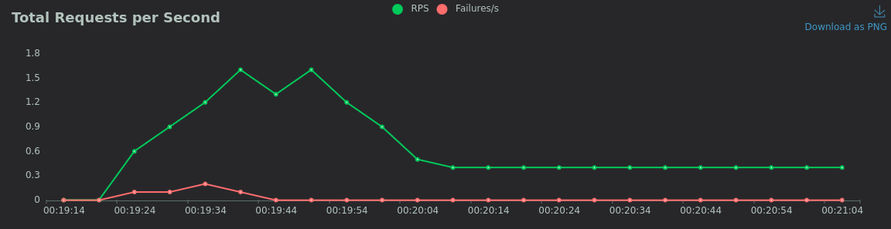

# Cloud Basic 2024 - Exercise 1: Using Nextcloud for a user-friendly, containerizable, scalable storage system

## Introduction

A great example of a container-deployable cloud solution is a storage system. A storage system offers an online platform that allows users to register, login and have a dedicated space to store files. File storage can be offered through a number of file transfer protocols, such as FTP, SMB and WebDAV, or through a web interface, typically operated from a web browser. A cloud storage platform may offer users additional services that pair well with the intrinsically synchronized and platform-independent nature of a storage system. Such services may include calendars, instant messaging, virtual collaborative workspaces, and similar.

Deploying a storage system requires a few fundamental building blocks and an analysis of a number of factors in order to find the best solution in terms of cost and effectiveness.

From a broad point of view, a storage system is mainly comprised of the following interconnected components:

- **storage**, either in the form of physical mediums capable of storing user data, or outsourced, i.e. relying on external storage solutions like S3 object storage

- **database**, holding the state of the instance(s) (e.g. configurations, users, credentials, user-specific settings...) typically in a relational or NoSQL database, directly connected and managed by the storage platform of choice

- **code** of the cloud platform (e.g. MinIO, Nextcloud), running on a node and coordinating other components to properly function

- **web server**, ensuring mediated access to the instance(s) and implementing security measures, load balancing, geo-distribution and other features

- **caching**, in the form of a file cache and/or a request cache (e.g. Redis), ensuring faster server turnaround, benefiting both the user (who waits less) and the provider (who has shorter exchange times and less occupied bandwidth)

_Note:_ for the sake of simplicity and in order to provide an easily deployable Proof of Concept, a few omissions were made in the presented implementation of the proposed solution. Request caching was not deployed, given it would not bring noteworthy improvement over that the expected number of users and considering the choice of tests to be performed on the system. Moreover, the storage component has been integrated in the instance code, therefore not providing an interchangeable, upgradable and scalable storage solution. Other approaches are taken into consideration in a following section.


## Implementation and discussion

The storage platform of choice for this implementation of a container-based storage system solution is Nextcloud. Nextcloud is an all-in-one on-premise solution providing all necessary building blocks for a working system, but can be expanded and integrated with other components in order to fit it to any specific use case and scenario. Nextcloud offers ready-to-use Docker and OCI container images, which renders it easily deployable and interoperable with other containerized services.

A Nextcloud instance offers some basic functionalities and a few optional services which might be of interest depending on the use case. Regular Nextcloud users are able to

- login with credentials generated by the administrator (or register on their own, if such feature has been enabled by the administrator),

- access a dedicated (private) storage space through a browser-based UI,

- browse previously uploaded files, organize them in folders, download, rename, move, copy and delete them,

- upload new files,

- share files generating a URL (depending on the accessibility of the system).

A number of other features are available to regular users, such as file tagging and photo display, which are outside the scope of interest of this implementation. Users with administrator privileges can manage (i.e. create, delete, change previleges for, and so on) users and change all instance settings, which reflect on all other users sharing the same instance. 

In its simplest form, a single Nextcloud instance is run within a single container. The default Docker image for Nextcloud includes the instance code itself and an Apache2 web server listening for HTTP connections. The following sections explore how this bare minimum solution was expanded and configured to provide a more secure and scalable system. 


### Storage

The core of Nextcloud storage is its `data` folder, containing all user data. Within the scope of this implementation and for the sake of simplicity, the entire Nextcloud installation folder was mounted as persistent storage, allowing to persist not only data, but also configuration and other instance-related files.

As previously mentioned, storage was not implemented independently from the application instance. Being meant to run on a single machine spawning multiple containers, the implemented system would not have benefited from a compartimentalized storage approach. Several approaches can be explored and could be applied in a larger-scale real world scenario.

#### S3

S3 (Simple Storage Service) is a **ST**orage **a**s **a S**ervice provider, i.e. a cloud-based object storage service provided by AWS (Amazon Web Services). Object storage in general allows to store any type of data (also binary) with an associated key and to retrieve it using such key. It is typically used as a backup solution but can also serve as a backing storage for a cloud storage system like Nextcloud. Nextcloud in particular can be configured to use S3 or an S3-compatible bucket as its primary storage space, avoiding the use of dedicated hardware. There exist many different S3-compatible providers which differ in cost and capacity, both for end users and enterprises.

Offloading storage to an external service like S3 has its own advantages and disadvantages, which must be taken into account considering the specific use case. In general, relying on external storage eliminates the need to host physical storage mediums, which can be expensive, energy-demanding, prone to failures and anyway needy in terms of maintenance. Outsourcing storage space also implies the possibility to dynamically scale storage space according to system usage. Object storage providers offer a variable amount of storage space through the so-called _pay-as-you-go_ billing model, which allows to pay a periodic rate or a fee determined as a function of the volume of transferred data.

Using S3 as an external storage solution might have some disadvantages under certain conditions. While convenient for storing big amounts of data, using object storage on smaller volumes can be costly and introduce additional latency and transfer time compared to on-premise storage solutions. Data security can also be a concern when outsourcing storage space, introducing the need to encrypt data before uploading it to third-party services. In a small-sized scenario, e.g. a company wanting to establish a shared storage space for its employees, with 10 to 100 expected users and sensitive data to be safeguarded, on-premise storage may be a better choice.

#### Distributed Filesystems

When opting for an on-premise storage solution, a feasible approach would be to further compartimentalize storage space across multiple (redundant) nodes, using a Networked Filesystem like NFS or a Distributed Filesystem (DFS) like CEPH.

NFS is a simple networked filesystem capable of exposing drives over a LAN or WAN. It allows to locally mount drives that are physically attached to a remote server. It offers a simple approach that leaves redundancy and availability to be solved independently. 

CEPH allows to create a clustered storage infrastructure that can be used either as block storage, file storage or object storage. It provides an inherently distributed and scalable solution that can spread across multiple nodes allowing to dynamically manage (add and remove) storage space and guaranteeing availability and redundancy of the stored data. It is usually the preferred approach for medium- to large-sized scenarios.

### Database

Although initially equipped with an internal SQLite database, a Nextcloud instance can be configured to use an external database management system. This also follows from the recommendations on the official documentation. The DBMS of choice for this implementation was PostgreSQL. A single container is spawned alongside the instance(s) of Nextcloud, exposing a PostgreSQL instance to other attached containers. Nextcloud is then configured to look for (or create) a database using such DBMS and use it to store all instance-specific data.

When using multiple Nextcloud instances (see later section), a single database instance is kept in order to provide consistency among different instances running in parallel. 


> Database balancing schema is courtesy of [An insiders look into scaling Nextcloud](https://indico.cern.ch/event/663264/contributions/2818170/attachments/1592445/2520694/An_insiders_look_into_scaling_Nextcloud_-_Matthias_Wobben.pdf)

Further balancing measures can be put into pratice. As shown in the image above, a well-established practice for scaling database is to use a Master-Slave database cluster. This allows for a redundant setup, in an independent fashion with respect to storage and/or application instances. A dedicated database cluster can be setup, for example, using MySQL Galera (for MySQL databases); PostgreSQL provides an integrated clustering option, which renders it a better starting option that ensures ease of potential scalability, as the system grows.

In a small-sized system, like the implemented one, a single dedicated database node has been considered sufficient.

The following is the `docker-compose` YAML snippet that is relevant to the deployed database container.

```yaml
volumes:
  db:

db:
  hostname: db
  image: postgres
  restart: always
  shm_size: 128mb
  volumes:
    - db:/var/lib/postgresql/data
  environment:
    - POSTGRES_USER_FILE=/run/secrets/nc-postgres-user
    - POSTGRES_PASSWORD_FILE=/run/secrets/nc-postgres-passwd
    - POSTGRES_DB=nextcloud
  secrets:
    - nc-postgres-user
    - nc-postgres-passwd

secrets:
  [...]
```

The `secrets` section contains references to local files containing credentials to be used by PostgreSQL when setting up the database. Such credentials are shared with Nextcloud instance containers in order for them to be able to connect to the created PostgreSQL database. The `volumes` section instantiates a Docker volume to be used by PostgreSQL for its `data` folder, in order to persist it across restarts.  

### Code

Actual Nextcloud instances were run using dedicated Docker containers. The image of choice is the latest available version of the `nextcloud` image, in turn refers to the last `nextcloud:apache` image. Such image packages a Nextcloud instance running behind an Apache2 web server, configured to listen for HTTP connections on port `80`. Albeit a ready-to-use package, the packaged web server was not addressed directly to access the Nextcloud instance, as explored in the following section.

The following is the `docker-compose` YAML snippet that is relevant to the deployed Nextcloud container.

```yaml
volumes:
  nextcloud:

app:
  hostname: nc1
  image: nextcloud
  restart: always
  links:
    - db
  depends_on:
    - db
  volumes:
    - nextcloud:/var/www/html
  environment:
    - POSTGRES_HOST=db
    - POSTGRES_DB=nextcloud
    - POSTGRES_USER_FILE=/run/secrets/nc-postgres-user
    - POSTGRES_PASSWORD_FILE=/run/secrets/nc-postgres-passwd
    - NEXTCLOUD_ADMIN_USER_FILE=/run/secrets/nc-admin-user
    - NEXTCLOUD_ADMIN_PASSWORD_FILE=/run/secrets/nc-admin-passwd
  secrets:
    - nc-admin-user
    - nc-admin-passwd
    - nc-postgres-user
    - nc-postgres-passwd

secrets:
  [...]
```

The `secrets` section contains references to local files containing credentials to be used to connect to the previously setup PostgreSQL database and credentials to be used by the Nextcloud application to configure the administrator user. The `volumes` section instantiates a Docker volume in which the entire installation of Nextcloud (including code, configuration and data) resides, in order to persist it across restarts.

_Note:_ in the proposed setup, Nextcloud instances are not intended to be spun up via `docker-compose`, but instead spawned on-the-fly, as explained later, with the corresponding `docker run` directive, shown in the _Testing_ section.

#### Configuration

Nextcloud configuration default are pretty robust in terms of security. By default, only connections coming from `localhost` domain are trusted and allowed; every other domain must be explicitly added to the `trusted_domains` in the configuration file. As mentioned, user registration is disabled by default and must be enabled using an app to be installed by an administrator using the WebUI administration panel. User passwords are safe by default, requiring a minimum length and complexity to be accepted by the system.

Measures to prevent bruteforce attacks and DDoS attacks are enabled by default and have to be disabled in order to perform intensive tests.

### Web server

As mentioned, the default Nextcloud Docker image contains an Apache2 web server that serves the PHP Nextcloud application itself. Instead of accessing such server directly, a _reverse proxy_ setup was used in order to implement additional security and load balancing features, explained thereafter.

First and foremost, as per the default Apache2 implementation, each Nextcloud instance listens for plain HTTP connections on port `80`. Different instances running within different containers can be mapped to different ports on the host machine, but this would result in multiple independent endpoints for the different instances. A feasible approach to solve this problem is to use a reverse proxy performing the **load balancing** among different _upstream_ servers. In this case, multiple Nextcloud servers, running within different containers, represent the _backend_ for a single balanced endpoint, managing incoming and outgoing connections to and from such servers. For this implementation HAProxy has been used for this purpose.

Looking at the configuration it is possible to have a better understanding of the reverse proxy's intended behavior.

```rust
frontend www
  bind :443 ssl crt /certs/site.pem
  default_backend nc

backend nc
  mode http
  balance roundrobin
  stick-table type integer size 1k expire 3h
  stick on dst_port
  server nc1 nc1:80 check resolve-prefer ipv4
  server nc2 nc2:80 check resolve-prefer ipv4
  server nc3 nc3:80 check resolve-prefer ipv4
  server nc4 nc4:80 check resolve-prefer ipv4
  server nc5 nc5:80 check resolve-prefer ipv4
  server nc6 nc6:80 check resolve-prefer ipv4
  server nc7 nc7:80 check resolve-prefer ipv4
  server nc8 nc8:80 check resolve-prefer ipv4
```

This setup creates the `www` _frontend_, i.e. an endpoint, bound to port `443` (default for HTTP over SSL/TLS) using a given SSL certificate. Further details about this aspect are given in the following section. Such frontend is configured to use the `nc` backend, which is a pool of upstream servers, from which one is picked to serve connected clients according to the configured balancing strategy. The `roundrobin` balancing strategy indicates to distribute connected clients in a circular fashion among all available backend servers. Backend servers point to Nextcloud instances accessible over Docker's internal network by container hostname. The `resolve-prefer ipv4` backend server directive, along with the `default-server init-addr none` and a properly configured DNS resolver, ensure that backend servers' hosts are resolved at runtime only, in order to periodically assess their availability.

The idea behind this load balancing strategy is to have several "slots" assigned to backend servers, each pointing to a Nextcloud instance running in a container with the specified hostname. The actual instances do not run all the time, but can be dynamically spawned as shown in a later section. The task of load balancing is then left to the reverse proxy, routing connections to the available instances.

#### Security

Apart from serving as a load balancer, HAProxy is also used to secure connections to the running instances. When running and accepting connections, the upstream servers operate on port `80` over plain insecure HTTP. Actual connections to the instances are however handled by the proxy, which is configured to only use secured HTTP over SSL connections on port `443`. The used SSL certificate have been generated by the Let's Encrypt authority and obtained using the `certbot` utility as associated to a specific domain. The domain in question is `claudio.ext.io`. All connections in the test environment of this implementation have been performed using this domain, which does not resolve to a specific remote location, but instead to the local loopback address `127.0.0.1`. Associating a FQDN with the localhost address makes it possible to have a certified HTTPS connection even during testing. In a real world scenario this would then be replaced by a production-ready instance running on a publicly available server, which was never the case for the sake of this implementation.

After successfully configuring the proxy and instances and following Nextcloud recommendations, the instances were also configured to always generate secure (`https://`) URLs and to demand the use of a secure connection by using HSTS headers.

## Testing

Setting up the proposed containerized solution requires the following steps to be performed.

1. Cloning the repository containing all Docker and configuration files (possibly in a folder called `claudio`, as shown, in order for other commands to work without adaptation)

```bash
$ git clone https://github.com/dododevs/units-cloud-final claudio
```

2. Ensuring to have Docker correctly installed and configured for the machine of interest, referring to the official guides on the [Docker website](https://docs.docker.com/get-docker/)

3. Populating the `secrets/` folder with the following files and respective content:

- `nc-admin-user.txt`, containing the username of the Nextcloud administrator user to be created
- `nc-admin-passwd.txt` containing the password of the Nextcloud administrator user to be created 
- `nc-postgres-user.txt`, containing the username of the PostgreSQL user to be created and used
- `nc-postgres-passwd.txt`, containing the password of the PostgreSQL user to be created and used

4. Generating a PEM file containing an SSL [possibly self-signed] certificate and its private key and saving it in the `haproxy/certs/site.pem` file

5. Spinning up the proxy and database containers

```bash
$ docker compose up -d
```

6. Spawning any number $[1, 8]$ of additional containers running Nextcloud instances  

```bash
$ docker run 
  --name nc1 # replace with nc<instance number>
  -h nc1 # replace with nc<instance number>
  --link claudio-db-1:db # replace claudio-db-1 with the name of the database running the database
  -v claudio_nextcloud:/var/www/html # replace claudio_nextcloud with the name of the created volume hosting the Nextcloud installation
  -e POSTGRES_HOST=db 
  -e POSTGRES_DB=nextcloud 
  -e POSTGRES_USER=$(cat secrets/nc-postgres-user.txt)
  -e POSTGRES_PASSWORD=$(cat secrets/nc-postgres-passwd.txt)
  -e NEXTCLOUD_ADMIN_USER=$(cat secrets/nc-admin-user.txt)
  -e NEXTCLOUD_ADMIN_PASSWORD=$(cat secrets/nc-admin-passwd.txt)
  --net claudio_default 
  -d
  nextcloud
```

### Performance

Reliability and performance of the proposed system, along with load balancing patterns and under load behavior, were tested using the _Locust_ Python library.

Locust allows to create automatized HTTP test suites. It has been used to generate data about performance under load with a variable number of users, size of the uploaded files and running instances. The Locust script used for these tests is `benchmark.py`, which is thoroughly documented. Noteworthy results are hereby presented.


With this general IO load test it is possible to observe that the system is able to handle both 8 and 16 concurrent users. No information about turnaround time of the HTTP requests is available through this test.

Proceeding further, exploiting a second spawned instance with load balancing provided by the reverse proxy. 



As expected, no remarkable difference can be seen as both instances are running on the same machine, therefore sharing the same resources. Further tests regarding transfer speed and involving artificially modified conditions (e.g. limiting resources) could provide more information. A more sensible use of such a setup would involve multiple nodes.


Even though not effective in improving performance overall, it can be observed through HAproxy statistics panel that the load balancing strategy is indeed working as expected, distributing the load across multiple, independent servers spawned on-the-fly, all referring to the same Nextcloud instance.

# Cloud Advanced 2024 - Exercise 1 (Nextcloud @ Kubernetes)

Let's investigate the possibility to extend the previously presented solution by deploying a similar service to a cluster of nodes. In order to achieve such goal, a few changes are needed to the analyzed infrastructure, allowing to setup a Kubernetes nodes cluster.

As a Proof of Concept, a single node worker has been deployed, while another one served as the control plane. For the sake of the presented implementation, two Virtual Machines have been created on a Proxmox environment. Both have been initialized with the same (virtual) hardware specs (1 CPU, 2048MB of RAM, 32 GiB of disk storage) and have been interconnected with a bridged network that binds them to an Ethernet link. also providing access to the Internet. A static IP is used for connecting the guest OS to such network. The chosen guest OS is the latest available LTS version of Ubuntu Server, i.e. 22.04 at the time of writing.

The chosen Kubernetes distribution for bootstrapping and managing the cluster is [k3s](https://k3s.io/). K3s's server-agent topology is summarized in the following map.


As can be seen, every node has some fundamental shared components, such as the Kubelet and the inter-node network and uses the same container engine, i.e. `containerd`, to spawn and maintain pods, i.e. groups of containers. The default network implementation used by K3s is Flannel. The main strengths of K3s are its ease of deployability, lightweightness and reduced complexity, when compared to other more extended alternatives.

## Implementation

The proposed implementation is based on the [Helm chart](https://github.com/nextcloud/helm/blob/main/charts/nextcloud/README.md) made available by [Nextcloud](https://nextcloud.github.io/helm/). The chart is configured before deployment through the `values.yml` file, which allows to customize the installation of Nextcloud and enable additional components. 

In this case, an **nginx** reverse proxy is used to expose the Nextcloud app, which in turn uses an fpm php server internally. Using nginx makes it possible to customize the HTTP(S) configuration and, for instance, add support for the TLS/SSL layer. The Nextcloud instance is configured through the use of Kubernetes secrets to store admin credentials. The backing database of choice is **PostgreSQL**, also configured using secrets and deployed in a separate pod, locally bound to the Nextcloud pod. For the sake of this PoC, redis caching was not enabled.

External access to the cluster is configured through a **service** of type Load Balancer. Although Kubernetes does not include a default load balancer, K3s does ship with so-called `ServiceLB`, which allows to expose the cluster to external HTTP(S) access. The use of Ingress or Gateway API was therefore not needed.

Persistent storage for Nextcloud and PostgreSQL was provisioned with Persistent Volume Claims (PVCs), as shown in the README.

## Solution strenghts and limitations discussion

The main point in implementing a software solution as a Kubernetes cluster, with respect to a single-host containerized solution like Docker, is the scalabity- and high-availability-readiness of such a solution. A Kubernetes cluster can easily and quickly scale both vertically (allocating more resources for each pod and/or changing the mapping strategy) and horizontally (incrementing the number of pods and/or nodes in the cluster), without the need to change the entire infrastructure. Redundancy and therefore high-availability are also built into Kubernetes by default, with its main goal being to maintain the desidered status of the cluster through rescheduling and automatic healing. Such features are not readily available with a containerized solution like Docker, which (at its core) runs on a single machine, which therefore constitutes a single point of failure, and has less room for expandability and quick scalability without substantial changes to the topology. Moreover, solutions with Kubernetes are orchestrated, eliminating the need to maintain a synchronization and communication pattern among different nodes. The flexibility and overall better efficacy of Kubernetes as an infrastructural choice naturally comes with a cost: complexity and resource consumption. A containerized solution can be deployed on as little as a single node (without any particular requirements in terms of specs), while a well-suited Kubernetes solution requires multiple interconnected nodes which run specialized orchestration software on top of the containerization technology of choice, introducing additional overhead. A Kubernetes infrastructure is also quite complex in nature, with many different coordinated components to be properly configured and adjusted to the specific use case.

Overall, depending on the size and complexity of the sought-after solution and its indended use and installation scenario, it might be more appropriate to use a simpler yet less reliable, available and scalable containerized solution like Docker or a more complex, high maintenance and demanding clustered solution like Kubernetes.

### High-availability limitations of the presented implementation

The presented solution is of course far from a production-ready highly-available setup. With a single worker node and the general limitations of the employed architecture (e.g. storage, as outlined in the following section) it does not bear much difference to running Nextcloud on one's personal computer without attaching any storage nor configuring any redundancy or possibility to reach it from the outside world.

Some steps that should be taken to improve such setup could be, for instance:

- _Setting up a larger cluster on dedicated hardware with a suitable number of nodes_: this would guarantee **redundancy** with more than one node being able to serve code and data and **load balance**, with the possibility of serving a larger number of users, distributing the load among more workers

- _Configuring and securing access from the outside world_, meaning **reachability** and **safety**, obtained properly configuring Ingress or Gateway and implementing security measures such as connection and file encryption 

- _Decoupling the cluster from local resources_, like storage, improving quick **scalability**, already facilitated by the Helm chart supporting HPA (Horizontal Pod Autoscaler)

- _Improving caching_, with file, database and request (Redis) caching

### Storage limitations of the presented implementation

Although more easily scalable in nature, a Kubernetes solution might have limitations due to its implementation details. For the sake of this implementation, for example, the utilized backend storage for database and Nextcloud installation is `local-path` (as outlined in the README as well), which binds such storage mountpoints to local paths on some node of the cluster. This solution is clearly demonstrational and offers a great limitation both to the scalability and to the reliability of the entire setup. A local path on a node is not a redundant solution, therefore constituting a single point of failure. It is also poorly scalable without allocating more resources on the node(s) themselves (if possible).

A better solution would be to use dynamically allocated storage, either on-premise (through the use of a distributed filesystem for instance) or outsourced to a third-party, as discussed in a previous section.  